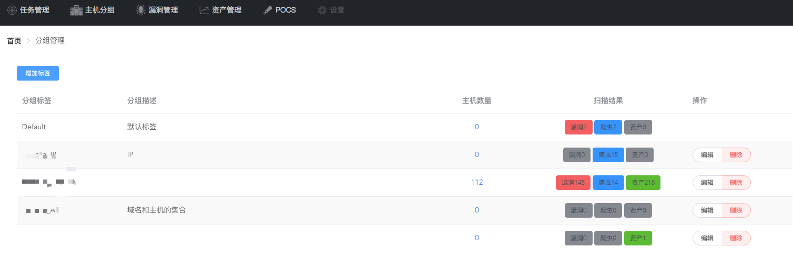
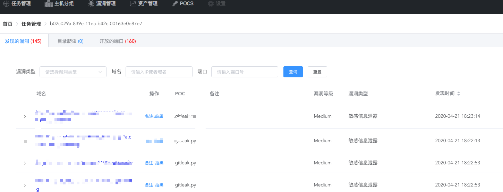
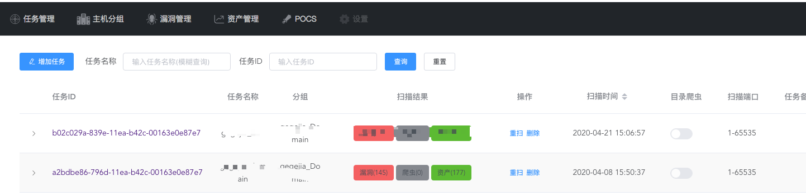

腾讯的TSS扫描器框架:  <https://mp.weixin.qq.com/s/uT8PmlKEAZkouIe8wAkLaA>
1. 腾讯的TSS扫描器框架里面，有识别ssl的方式，可以根据实际的ssl通信过程来判断https协议
2. 发送POC的requests需要封装为一个库
3. 增加UA的随机性

## 结构

```
Python3 + Vue + Redis + MongoDB + Celery
```

## 安装:

```sh
Python3
mongDB的服务端数据库要求版本>=3.6
redis-server
mkdir logs
echo > logs/error.log
echo > logs/info.log
pip3 install -r requirements.txt
use xscan
db.createUser({ user: "xscan", pwd: "xscan", roles: [{ role: "userAdminAnyDatabase", db: "admin" }] })

gunicorn -b127.0.0.1:8888 --chdir /opt/scan/server api:app
cd celerynode
celery -A tasks worker -l info
cd ../plugin
celery -A tasks worker -l info
python subscribe.py

如果是本地测试环境，需要node来编译:
npm run dev
开发环境可以先在本地编译好，然后上传过去，直接用nginx指向dist目录就可以了:
npm build
```

## 功能
1. 使用masscan和nmap进行端口扫描
2. BBscan来进行爬虫扫描
3. POC-T来进行POC扫描

## 说明书

```
1. 不同扫描目标可以作为分组，比如今天扫的主机属于X分组，明天扫的主机是Y分组。
2. 扫描任务没有优先级，也就是说如果有临时要扫的目标，那就只能等之前的先扫完。
3. 只适合批量扫描，不适合单个扫描，代码里面的端口扫描限制了只扫描前20个端口，因为没有判断port spoorf，当然，这个是可以改的
```

## 缺点
```
1. 代码垃圾,变量混乱,数据库结构不合理
2. POC要改,而且没有界面修改POC
3. 黑名单的数据没有展示
4. 后端接口没有用户密码验证功能 
```
## 优点
```
大概是有一个UI？
```


### 预览




### TODO:
1. 白名单不跑POC，和BBScan共享一个白名单
2. 增加同IP部署的网站
3. 增加C段存活的主机现实
4. 优化celery扫描速度

### 参考:
* <https://github.com/lijiejie/BBScan.git>
* <https://github.com/Xyntax/POC-T.git>
* <https://github.com/w-digital-scanner/w11scan>
* <https://github.com/superhuahua/xunfengES.git>
* <https://github.com/w-digital-scanner/w12scan-client.git>
* <https://github.com/al0ne/Vxscan.git>
* <https://github.com/0xbug/Hawkeye>
